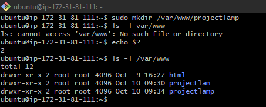

# PROJECT 1 - WEB STACK IMPLEMENTATION (LAMP STACK) IN AWS
## STEP 1 — INSTALLING APACHE AND UPDATING THE FIREWALL
### Install Apache using Ubuntu’s package manager ‘apt’ 
- `sudo apt install apache2`

### Verify that apache2 is running as a Service in OS
- `sudo systemctl status apache2`

### Open TCP port 80 which is the default port for web browsers to receive traffic

### Test that Apache HTTP server can respond to requests from the Internet - type http://Public-IP-Address:80 in your browser

 

 ## STEP 2 — INSTALLING MYSQL
 ### Install mysql
 - `$ sudo apt install mysql-server`

 
 ### Log in to the MySQL console
- `sudo mysql`

 
 ### Run security script that comes pre-installed with MySQL to remove some insecure default settings
 - `ALTER USER 'root'@'localhost' IDENTIFIED WITH mysql_native_password BY 'PassWord.1';`

  
  ### Test that you’re able to log in to the MySQL console
 -  `$ sudo mysql -p`

## STEP 3 — INSTALLING PHP
### Install PHP
- `sudo apt install php libapache2-mod-php php-mysql`

### Confirm your PHP version
- `php -v`

## STEP 4 — CREATING A VIRTUAL HOST FOR YOUR WEBSITE USING APACHE
### Setup domain/Create project directory
- `sudo mkdir /var/www/projectlamp`

###  Assign ownership to directory
- `sudo chown -R $USER:$USER /var/www/projectlamp`
### Create Virtual Host conf for project
- `sudo vim /etc/apache2/sites-available/projectlamp.conf`

### Enable project
- `sudo a2ensite projectlamp`

### Disable default site
- `sudo a2dissite 000-default`

### Test configurations
- `sudo apache2ctl configtest`

### Reload Apache2 service

- `sudo apache2ctl configtest`
### Reload Apache2 service
- `sudo systemctl reload apache2`
### Create an index.html file
- `sudo echo 'Hello LAMP from hostname' $(curl -s http://169.254.169.254/latest/meta-data/public-hostname) 'with public IP' $(curl -s http://169.254.169.254/latest/meta-data/public-ipv4) > /var/www/projectlamp/index.html`

## STEP 5 — ENABLE PHP ON THE WEBSITE
### Edit dir.conf to place index.php at higher precedence
- `sudo vim /etc/apache2/mods-enabled/dir.conf`

### Create PHP index page
- `sudo vim /var/www/projectlamp/index.php`

